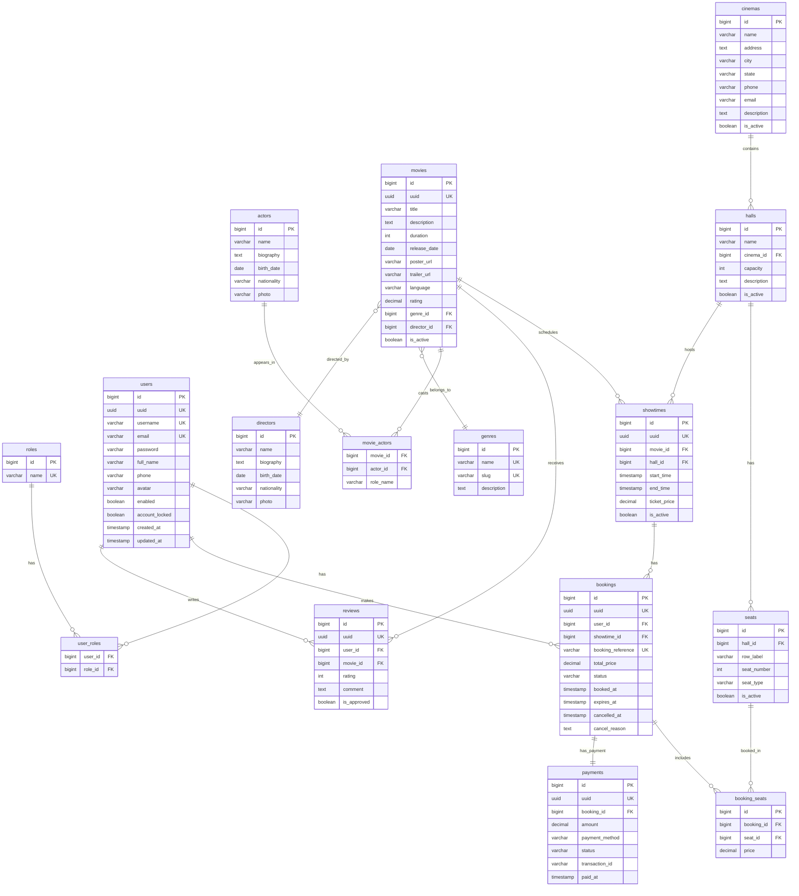

# Movie Ticket Booking System

A full-featured web application for browsing movies, selecting seats, booking tickets, and managing cinema operations — built with Spring Boot 3.5 and modern Java.

## Overview

The Movie Ticket Booking System provides three tiers of access:

- **Guests** can browse movies, view showtimes, and search the catalog.
- **Customers** can register, book tickets with interactive seat selection, manage bookings, and rate movies.
- **Administrators** have a dashboard with revenue analytics, manage movies/cinemas/halls/showtimes, handle bookings and customers, moderate reviews, and generate reports.

The system uses PostgreSQL for persistence, Flyway for migrations, Thymeleaf + Bootstrap 5 for the frontend, Chart.js for admin reports, and SweetAlert2 for user notifications.

## Tech Stack

| Category            | Technologies                                                                 |
| ------------------- | ---------------------------------------------------------------------------- |
| **Language**        | Java 21                                                                      |
| **Framework**       | Spring Boot 3.5+                                                             |
| **Data Access**     | Spring Data JPA, Hibernate, Flyway (database migrations)                     |
| **Security**        | Spring Security, BCrypt, Remember-Me, Session Management                     |
| **Frontend**        | Thymeleaf, Bootstrap 5, Bootstrap Icons, Chart.js, SweetAlert2               |
| **Database**        | PostgreSQL 16+                                                               |
| **Mapping**         | MapStruct                                                                     |
| **Code Gen**        | Lombok                                                                       |
| **Validation**      | Jakarta Bean Validation (Hibernate Validator)                                |
| **Testing**         | JUnit 5, Mockito, Spring Security Test, H2 (in-memory test DB)               |
| **Build**           | Maven 3.9+                                                                   |

## Features

### Guest Features

- Browse movies (paginated, with poster, rating, genre, language)
- Search movies by keyword, genre, language, minimum rating
- View movie details (description, cast, trailer, duration, release date)
- View showtimes per movie across cinemas and dates
- View seat layout for a showtime
- Register a new account
- Login / Logout

### Customer Features

- **Dashboard** — view profile summary and recent bookings
- **Profile Management** — update full name, phone, avatar
- **Change Password** — secure password update with current password verification
- **Movie Browsing** — filter by genre, language, rating, search by keyword
- **Interactive Seat Selection** — choose showtime → cinema → date → seats (VIP seats highlighted; unavailable seats disabled)
- **Booking Flow**:
  1. Select movie
  2. Select cinema
  3. Select date
  4. Select seats
  5. Review booking and proceed to checkout
  6. Simulate payment (choose payment method, transaction recorded)
- **Booking History** — view all past and upcoming bookings
- **Booking Detail & Printable Ticket** — view full booking info with seat details, QR-ready reference
- **Cancel Booking** — cancel before showtime starts
- **Rate & Review Movies** — submit rating (1–5) and comment after attending a movie; reviews require admin approval
- **Edit / Delete Reviews** — manage own reviews

### Admin Features

- **Dashboard** — total movies, customers, cinemas, revenue; monthly revenue chart (Chart.js); occupancy rate; top 5 most-booked movies
- **Movie Management** — CRUD (title, description, duration, release date, poster, trailer, language, genre, director, actor assignment); soft-delete
- **Genre / Actor / Director Management**
- **Cinema Management** — CRUD with soft-delete
- **Hall Management** — create/edit/delete halls within a cinema; manage seat layout (row, seat number, seat type)
- **Showtime Scheduling** — create showtimes with automatic overlap prevention within the same hall
- **Booking Management** — view all bookings, search by keyword, cancel bookings
- **Customer Management** — view all customers, lock/unlock accounts
- **Review Moderation** — approve or delete pending reviews
- **Reports** — monthly revenue, booking counts, new customers, occupancy rate

## Project Structure

```
com.nguyen.movieticket/
├── config/                     # Application configuration
│   ├── SecurityConfig.java         - Spring Security (form login, remember-me, session mgmt)
│   ├── WebMvcConfig.java           - Resource handlers, view controllers
│   ├── SchedulingConfig.java       - @Scheduled task support
│   ├── ThymeleafConfig.java        - Thymeleaf custom dialect config
│   └── GlobalControllerAdvice.java - Global model attributes
├── controller/                 # MVC controllers (Thymeleaf views)
│   ├── HomeController.java         - Home page, about page
│   ├── AuthController.java         - Login, register
│   ├── MovieController.java        - Browse, search, movie detail
│   ├── BookingController.java      - Booking flow (select movie → cinema → date → seats → checkout → pay)
│   ├── CustomerController.java     - Dashboard, profile, bookings, ticket, cancel
│   ├── ReviewController.java       - Create, edit, delete reviews
│   ├── AdminController.java        - Admin dashboard, CRUD management, reports
│   └── SeatController.java         - REST API: get available seats for showtime
├── dto/
│   ├── request/                    - Command objects (RegisterRequest, BookingRequest, etc.)
│   └── response/                   - View models (MovieResponse, BookingResponse, etc.)
├── entity/                     # JPA entities
│   ├── User.java, Role.java
│   ├── Genre.java, Actor.java, Director.java
│   ├── Movie.java, MovieActor.java
│   ├── Cinema.java, Hall.java, Seat.java, SeatType.java
│   ├── Showtime.java
│   ├── Booking.java, BookingSeat.java, BookingStatus.java
│   ├── Payment.java, PaymentStatus.java
│   └── Review.java
├── exception/                  # Custom exceptions & global handler
│   ├── ResourceNotFoundException, BadRequestException, BookingException
│   ├── PaymentException, InvalidOperationException, DuplicateResourceException
│   ├── UnauthorizedException
│   └── GlobalExceptionHandler.java
├── mapper/                     # MapStruct mappers (Entity ↔ DTO)
├── repository/                 # Spring Data JPA repositories
├── security/                   # Spring Security integration
│   ├── CustomUserDetails.java
│   └── CustomUserDetailsService.java
├── service/                    # Service interfaces
├── service/impl/               # Service implementations
├── util/                       # Utilities (BookingReferenceGenerator)
└── validation/                 # Custom validation annotations & validators
    ├── @PasswordMatches, @UniqueUsername, @UniqueEmail
    └── Implementations
```

## Database Schema

The database consists of **16 tables** with the following design:

### Tables

| # | Table | Description |
|---|-------|-------------|
| 1 | `roles` | Role definitions (ROLE_CUSTOMER, ROLE_ADMIN) |
| 2 | `users` | User accounts (username, email, password, profile fields, lock/enabled status) |
| 3 | `user_roles` | Many-to-many user-role assignment |
| 4 | `genres` | Movie genres (Action, Comedy, Drama, etc.) |
| 5 | `actors` | Actor profiles (name, biography, nationality) |
| 6 | `directors` | Director profiles (name, biography, nationality) |
| 7 | `movies` | Movie catalog (title, duration, rating, language, links to genre & director) |
| 8 | `movie_actors` | Many-to-many movie-actor mapping with role name |
| 9 | `cinemas` | Cinema branches (name, address, city, contact info) |
| 10 | `halls` | Screening halls within cinemas (name, capacity, unique per cinema) |
| 11 | `seats` | Individual seats in halls (row, number, type: STANDARD/VIP/COUPLE) |
| 12 | `showtimes` | Movie screening sessions (links movie + hall, start/end time, ticket price) |
| 13 | `bookings` | Customer bookings (reference, total price, status lifecycle) |
| 14 | `booking_seats` | Individual seats within a booking (price per seat) |
| 15 | `payments` | Payment transactions (one per booking, method, transaction ID, status) |
| 16 | `reviews` | User reviews for movies (rating 1–5, comment, approval status) |

### Key Relationships

- **User** → `user_roles` → **Role** (many-to-many)
- **User** → **Booking** (one-to-many)
- **User** → **Review** (one-to-many)
- **Movie** → **Showtime** (one-to-many)
- **Movie** → `movie_actors` → **Actor** (many-to-many)
- **Movie** → **Genre** (many-to-one)
- **Movie** → **Director** (many-to-one)
- **Cinema** → **Hall** (one-to-many)
- **Hall** → **Seat** (one-to-many)
- **Hall** → **Showtime** (one-to-many)
- **Showtime** → **Booking** (one-to-many)
- **Booking** → `booking_seats` → **Seat** (one-to-many)
- **Booking** → **Payment** (one-to-one)

### Indexes

- `idx_movies_title`, `idx_movies_genre`, `idx_movies_language`, `idx_movies_active`
- `idx_showtimes_movie`, `idx_showtimes_hall`, `idx_showtimes_start`
- `idx_bookings_user`, `idx_bookings_showtime`, `idx_bookings_status`, `idx_bookings_reference`
- `idx_payments_booking`
- `idx_reviews_movie`, `idx_reviews_user`
- `idx_seats_hall`

### Check Constraints

- `movies.duration > 0`
- `movies.rating BETWEEN 0 AND 10`
- `halls.capacity > 0`
- `seats.seat_number > 0`
- `showtimes.end_time > start_time`
- `bookings.total_price >= 0`
- `booking_seats.price >= 0`
- `payments.amount >= 0`
- `payments.status IN ('PENDING', 'COMPLETED', 'FAILED', 'REFUNDED')`
- `bookings.status IN ('PENDING', 'CONFIRMED', 'CANCELLED', 'EXPIRED')`
- `seats.seat_type IN ('STANDARD', 'VIP', 'COUPLE')`
- `reviews.rating BETWEEN 1 AND 5`

## Entity Relationship Diagram



## Getting Started

### Prerequisites

- **JDK 21** — [Download](https://adoptium.net/)
- **Maven 3.9+** — [Download](https://maven.apache.org/download.cgi)
- **PostgreSQL 16+** — [Download](https://www.postgresql.org/download/)
- **IDE** — IntelliJ IDEA recommended

### Setup

1. **Clone the repository**

   ```bash
   git clone https://github.com/yourusername/movieticket.git
   cd movieticket
   ```

2. **Create the PostgreSQL database**

   ```sql
   CREATE DATABASE movieticket_db;
   ```

3. **Configure database credentials**

   Edit `src/main/resources/application.yml`:

   ```yaml
   spring:
     datasource:
       url: jdbc:postgresql://localhost:5432/movieticket_db
       username: postgres
       password: your_password
   ```

4. **Build the project**

   ```bash
   mvn clean install
   ```

5. **Run the application**

   ```bash
   mvn spring-boot:run
   ```

6. **Access the application**

   Open [http://localhost:8080](http://localhost:8080) in your browser.

### Default Accounts

| Role     | Username  | Password      |
| -------- | --------- | ------------- |
| Admin    | `admin`   | `Admin@123`   |
| Customer | `john_doe`  | `Customer@123` |
| Customer | `jane_smith` | `Customer@123` |

## API Endpoints

### Authentication

| Method | Endpoint          | Description          | Auth Required |
| ------ | ----------------- | -------------------- | ------------- |
| GET    | `/auth/login`     | Login page           | No            |
| GET    | `/auth/register`  | Registration page    | No            |
| POST   | `/auth/register`  | Register new user    | No            |
| POST   | `/login`          | Login form submit    | No            |
| GET    | `/logout`         | Logout               | Yes           |

### Public / Home

| Method | Endpoint    | Description              |
| ------ | ----------- | ------------------------ |
| GET    | `/` / `/home` | Home page with featured & top-rated movies |
| GET    | `/about`    | About page               |

### Movies

| Method | Endpoint             | Description                  | Auth Required |
| ------ | -------------------- | ---------------------------- | ------------- |
| GET    | `/movies`            | Browse/search movies (paginated, filters: `keyword`, `genreId`, `language`, `minRating`) | No |
| GET    | `/movies/{uuid}`     | Movie detail page with showtimes & reviews | No |

### Booking Flow (Customer)

| Method | Endpoint                           | Description                       |
| ------ | ---------------------------------- | --------------------------------- |
| GET    | `/booking/select-movie`            | Step 1: Choose a movie            |
| GET    | `/booking/select-cinema?movieId=`  | Step 2: Choose a cinema           |
| GET    | `/booking/select-date?movieId=&cinemaId=` | Step 3: Choose a date      |
| GET    | `/booking/seats/{showtimeId}`      | Step 4: Interactive seat selection |
| POST   | `/booking/create`                  | Step 5: Create booking            |
| GET    | `/booking/checkout/{reference}`    | Step 6: Checkout page             |
| POST   | `/booking/pay`                     | Process payment (simulated)       |

### Seats API (REST)

| Method | Endpoint                     | Description                | Response                     |
| ------ | ---------------------------- | -------------------------- | ---------------------------- |
| GET    | `/api/seats/{showtimeId}`    | Get all seats for a showtime with availability status | `List<SeatResponse>` (JSON) |

### Customer Area

| Method | Endpoint                              | Description                      |
| ------ | ------------------------------------- | -------------------------------- |
| GET    | `/customer/dashboard`                 | Customer dashboard                |
| GET    | `/customer/profile`                   | View / edit profile               |
| POST   | `/customer/profile`                   | Update profile                    |
| GET    | `/customer/change-password`           | Change password form              |
| POST   | `/customer/change-password`           | Change password                   |
| GET    | `/customer/bookings`                  | Booking history                   |
| GET    | `/customer/bookings/{reference}`      | Booking detail                    |
| POST   | `/customer/bookings/{reference}/cancel` | Cancel booking                 |
| GET    | `/customer/bookings/{reference}/ticket` | Printable ticket view          |

### Reviews

| Method | Endpoint                 | Description                        |
| ------ | ------------------------ | ---------------------------------- |
| POST   | `/reviews/create`        | Submit a review (must have attended) |
| POST   | `/reviews/{id}/edit`     | Edit own review                    |
| POST   | `/reviews/{id}/delete`   | Delete own review                  |

### Admin Area

| Method | Endpoint                                  | Description                        |
| ------ | ----------------------------------------- | ---------------------------------- |
| GET    | `/admin/dashboard`                        | Admin dashboard with stats & charts |
| GET    | `/admin/movies`                           | List all movies                     |
| GET    | `/admin/movies/create`                    | Create movie form                   |
| POST   | `/admin/movies/create`                    | Save new movie                      |
| GET    | `/admin/movies/{id}/edit`                 | Edit movie form                     |
| POST   | `/admin/movies/{id}/edit`                 | Update movie                        |
| POST   | `/admin/movies/{id}/delete`               | Soft-delete movie                   |
| GET    | `/admin/genres`                           | List genres                         |
| GET    | `/admin/actors`                           | List actors                         |
| GET    | `/admin/directors`                        | List directors                      |
| GET    | `/admin/cinemas`                          | List cinemas                        |
| GET    | `/admin/cinemas/create`                   | Create cinema form                  |
| POST   | `/admin/cinemas/create`                   | Save new cinema                     |
| GET    | `/admin/cinemas/{id}/edit`                | Edit cinema form                    |
| POST   | `/admin/cinemas/{id}/edit`                | Update cinema                       |
| POST   | `/admin/cinemas/{id}/delete`              | Soft-delete cinema                  |
| GET    | `/admin/cinemas/{id}/halls`               | List halls in a cinema              |
| GET    | `/admin/halls/create/{cinemaId}`          | Create hall form                    |
| POST   | `/admin/halls/create`                     | Save new hall                       |
| GET    | `/admin/halls/{id}/edit`                  | Edit hall form                      |
| POST   | `/admin/halls/{id}/edit`                  | Update hall                         |
| POST   | `/admin/halls/{id}/delete`                | Soft-delete hall                    |
| GET    | `/admin/halls/{id}/seats`                 | Manage seat layout for a hall       |
| POST   | `/admin/halls/{id}/seats`                 | Save seat layout                    |
| GET    | `/admin/showtimes`                        | List showtimes                      |
| GET    | `/admin/showtimes/create`                 | Create showtime form                |
| POST   | `/admin/showtimes/create`                 | Save new showtime                   |
| POST   | `/admin/showtimes/{id}/delete`            | Soft-delete showtime                |
| GET    | `/admin/bookings`                         | List bookings (searchable)          |
| POST   | `/admin/bookings/{reference}/cancel`      | Cancel a booking                    |
| GET    | `/admin/customers`                        | List customers                      |
| POST   | `/admin/customers/{id}/lock`              | Lock customer account               |
| POST   | `/admin/customers/{id}/unlock`            | Unlock customer account             |
| GET    | `/admin/reviews`                          | List pending reviews for moderation |
| POST   | `/admin/reviews/{id}/approve`             | Approve a review                    |
| POST   | `/admin/reviews/{id}/delete`              | Delete a review                     |
| GET    | `/admin/reports`                          | Monthly reports with chart          |

## Business Rules

1. **Seat availability** — A seat cannot be double-booked for the same showtime. The system checks for overlapping `booking_seats` before confirming a booking.

2. **Booking status lifecycle** — `PENDING` → `CONFIRMED` (after payment) or `CANCELLED` / `EXPIRED`.

3. **Payment timeout** — Pending bookings expire after 10 minutes (configurable via `app.booking.payment-timeout-minutes`). A scheduled task runs every 60 seconds to expire stale bookings.

4. **Cancel window** — Bookings can only be cancelled before the showtime starts (checked server-side).

5. **Showtime overlap prevention** — The system prevents creating showtimes that overlap in the same hall. Overlap is detected by checking if any existing showtime's time range intersects with the new one.

6. **One review per user per movie** — A user can submit only one review per movie. Duplicates are rejected.

8. **Review requires attendance** — Only customers who have a confirmed booking for the movie can leave a review.

9. **Review approval** — All reviews require admin moderation (`is_approved = false` by default). Only approved reviews appear on the movie detail page.

10. **Seat pricing** — Seat price is calculated as: `ticket_price × multiplier`. Multipliers: STANDARD = 1.0, VIP = 1.5, COUPLE = 2.0.

11. **Soft deletes** — Movies, cinemas, halls, showtimes, and seats use `is_active` flag rather than hard deletion. Queries automatically filter inactive records via `@Where(clause = "is_active = true")`.

12. **Account locking** — Admin can lock/unlock customer accounts. Locked accounts cannot log in.

13. **Unique constraints** — Username, email, booking reference, and UUIDs are unique across the system. Hall names are unique per cinema. Seats are unique per hall by row + number.

14. **Password strength** — Passwords are encoded with BCrypt. The password change flow requires the current password for verification.

## Testing

```bash
mvn test
```

Tests use:
- **JUnit 5** — test framework
- **Mockito** — mocking dependencies
- **Spring Security Test** — security context for integration tests
- **H2 in-memory database** — test profile (configured in `src/test/resources/application-test.yml`)

## Security

### Authentication

- Form-based login with Spring Security
- Custom `UserDetailsService` loads users from the database
- Login page at `/auth/login`, login processing at `/login`

### Authorization

- **Role-based access control** with two roles: `ROLE_CUSTOMER` and `ROLE_ADMIN`
- URL patterns secured via the security filter chain:
  - `/admin/**` → requires `ROLE_ADMIN`
  - `/customer/**` → requires `ROLE_CUSTOMER`
  - `/api/**` → requires authentication
  - `/auth/**`, `/`, `/movies/**`, `/about` → public
- Method-level security annotations (`@EnableMethodSecurity`)

### Password Encoding

- BCryptPasswordEncoder (strength 10)
- Passwords hashed at registration and before storage

### Remember-Me

- Persistent token-based remember-me authentication
- Token stored in cookie, valid for 30 days
- Custom key (`uniqueAndSecret`) for cookie signing

### Session Management

- Session creation policy: `IF_REQUIRED`
- Maximum one session per user (concurrent login kicks previous session)
- Session expiry redirect: `/auth/login?expired=true`
- Session timeout: 30 minutes

### CSRF

- CSRF protection is disabled (the application uses Thymeleaf forms with hidden methods via `HiddenHttpMethodFilter`)

### Error Handling

- Custom error pages: `error/403`, `error/404`, `error/500`
- `GlobalExceptionHandler` with `@ControllerAdvice`:
  - AJAX / REST requests receive JSON error responses via `ApiResponse`
  - Regular requests receive appropriate error views
  - Handles: 404, 400, validation errors, 403, 401, and general 500 errors

## Deployment

### Build for Production

```bash
mvn clean package -DskipTests
```

This produces a fat JAR at `target/movieticket-1.0.0.jar`.

### Run as a Service

```bash
java -jar target/movieticket-1.0.0.jar
```

### Production Considerations

- Set `spring.jpa.hibernate.ddl-auto: validate` (already configured for production)
- Configure `spring.datasource` with production database credentials
- Set `spring.thymeleaf.cache: true` for template caching
- Configure proper PostgreSQL connection pool settings (HikariCP)
- Use environment variables or external config for secrets:

  ```bash
  java -jar target/movieticket-1.0.0.jar --spring.datasource.password=${DB_PASSWORD}
  ```

- Reverse proxy with Nginx or Apache for SSL termination
- Monitor with Spring Boot Actuator (add dependency if needed)
- Set up proper logging (file appender, log rotation)
